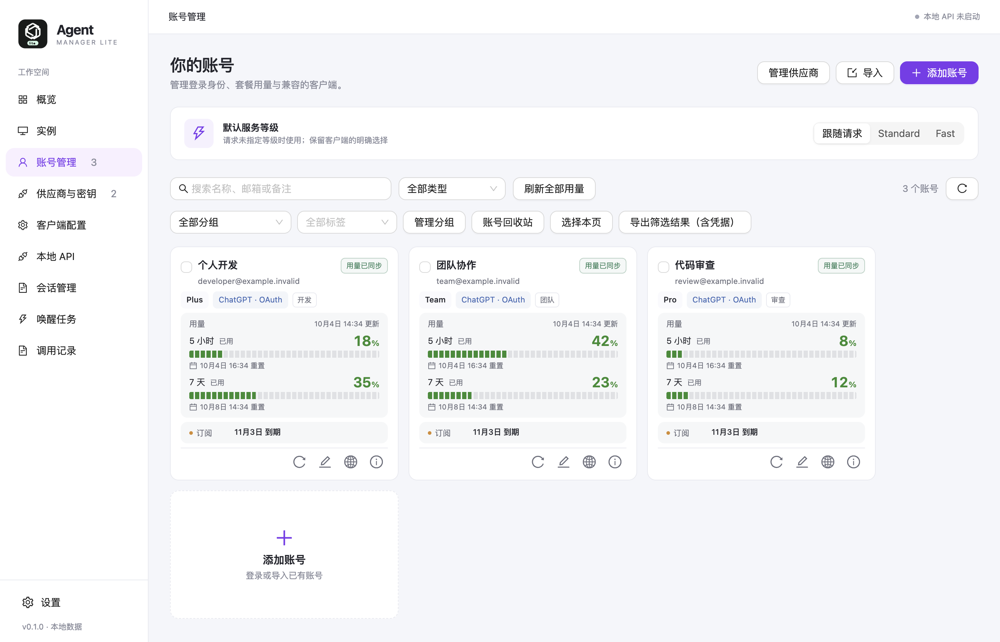
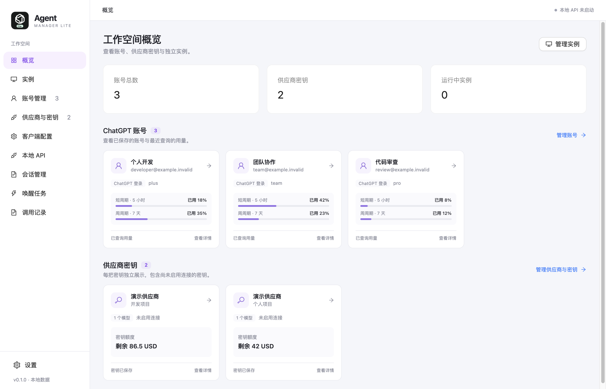

# Agent Manager Lite

[](https://github.com/sv3nbeast/agent-manager-lite/actions/workflows/ci.yml)

[简体中文](README.md) · English · [Downloads](https://github.com/sv3nbeast/agent-manager-lite/releases) · [Issues](https://github.com/sv3nbeast/agent-manager-lite/issues)

A lightweight Agent workspace organized around instances, with shared accounts, provider keys and client settings, gradually connecting terminal agents, desktop clients and AI editors.

**Create an instance → Choose a client → Choose a compatible account or provider → Configure the project → Launch**

**Codex** desktop and CLI are currently supported. More Agent clients and editors are being planned and evaluated; see Integration direction below.

## Screenshots

These screenshots capture the running v0.1.0 application content at its default window size and system theme. Accounts, providers and usage use demo data.



<details>
<summary>View workspace overview</summary>



</details>

## Features

- **Independent instances**: manage Codex desktop and CLI instances with automatically suggested, editable names. Choose an account, connection mode and session source, then preview, launch, stop or archive.
- **Accounts**: sign in to ChatGPT using a browser or device code, import accounts, and manage tags, groups, usage windows, subscription expiry and the account recycle bin. Expiry dates depend on the upstream response.
- **Providers and keys**: manage multiple API providers and keys, discover models through their APIs, and run cancellable connection and conversation tests.
- **Models and configuration**: choose a model, reasoning effort and preset or custom context window. Each API connection can set its own window per model and inherit provider defaults when unset; preview instance configuration changes and restore them.
- **Standard / Fast**: choose a speed in the existing menu of supported Codex desktop instances. The local API supports service tier settings and outbound tier records. Availability depends on the client version, model and provider.
- **Network proxies**: configure a default proxy and account overrides using HTTP, HTTPS, SOCKS5 or SOCKS5H.
- **Local API**: use multiple accounts, scheduling strategies and separate access keys with model restrictions and Token limits.
- **Sessions and records**: start fresh or copy sessions from an instance or local directory. Automatically discover local instances from compatible tools, including running sources. Preview session counts and project grouping, search project details, then create an independent snapshot of saved history, preserving the original directory. External sources on macOS APFS can remain active; new messages do not continuously sync to the copy. Directly reusing an existing directory still requires closing its source client. Copies skip temporary files, caches and worktree code, retain original project paths, and report stale session indexes omitted from the copy. Manage session import, export, copies and restoration, and query request history, statistics and CSV exports.
- **Data backups**: preview imports, export accounts or create encrypted portable data backups.

## Integration direction

Future integrations extend beyond Claude, aiming to connect more useful agents and editors through one instance entry point. The examples below are candidates and are not implemented yet; they are neither an exhaustive list nor a committed release schedule.

| Type | Integration candidates |
| --- | --- |
| Terminal agents | [Claude Code](https://code.claude.com/docs/en/overview), [Gemini CLI](https://geminicli.com/docs/), [OpenCode](https://opencode.ai/docs/), [Kiro CLI](https://kiro.dev/docs/) |
| Desktop agents | [Claude Desktop (Chat / Cowork / Code)](https://code.claude.com/docs/en/desktop), [OpenCode Desktop](https://opencode.ai/docs/) |
| AI editors and IDEs | [Kiro IDE](https://kiro.dev/docs/), [Cursor](https://cursor.com/docs), [VS Code / GitHub Copilot](https://code.visualstudio.com/docs/agents/overview), [Zed](https://zed.dev/docs/ai/overview), [Devin Desktop (formerly Windsurf)](https://docs.devin.ai/desktop/getting-started) |

New integrations will use the same Create an instance → Choose a client flow, with shared account and provider management. Sign-in, models, context windows, speed settings and instance isolation will follow each client's actual capabilities; provider keys will only be reused between compatible clients.

## Install and use

The current release target is **macOS Apple Silicon (arm64)**, with DMG and ZIP packages. Check [Releases](https://github.com/sv3nbeast/agent-manager-lite/releases) for available downloads; if none are available, run from source using the instructions below. Windows, Linux and other architectures have not been validated.

1. Install and open Agent Manager Lite, and prepare a local Codex desktop application or CLI.
2. Sign in to ChatGPT under Accounts, or add an API URL, key and models under Providers and Keys.
3. Create an instance, choosing Codex and a compatible account or provider.
4. Check the model, session source and launch preview, then launch. Choose desktop projects inside Codex; CLI instances can select a working directory beforehand.

New ChatGPT account instances default to native sign-in, which supplies the client's real login identity. Account features depend on the plan, workspace and client version. HTTP, HTTPS, SOCKS5 and SOCKS5H proxies also work with native sign-in. API keys and Agent Identity default to Local API; its provider menu is different from native ChatGPT sign-in. Existing instances keep their current mode and can be edited after stopping. If history is hidden after changing modes, select that instance under Sessions → Repair visibility and preview the repair for its connection mode.

If a proxy is required, configure the default network in Settings and override it per account as needed. Proxies apply to the manager’s login exchanges, token refreshes, usage queries, local API, and native desktop/CLI instances launched by the manager. Native instances retain their ChatGPT identity and use a dedicated local relay for authenticated upstream proxies. Explicit direct mode overrides inherited and system proxies. Closing the manager window keeps each relay alive until its instance exits. External browsers and independently launched clients use their own network settings.

While instances are active, Cmd+Q, menu Quit and the ordinary tray Quit close the management UI and keep its background services alive. Instances and their local API connections continue running; the manager exits after all instances finish and their configuration is restored. Reopen the app or show its window from the tray to resume management. The tray's “Quit and stop running instances” action stops the instances and exits completely.

Finish active work and wait for the manager to exit completely before installing an update. In-app automatic updates are not implemented. Packages include `SHA256SUMS.txt`; current builds do not have Developer ID signing or notarization.

## Data

Accounts and keys are encrypted locally with Electron `safeStorage`. Credentials are not saved if system encryption is unavailable. Account exports contain login credentials; portable data backups use a separate password for encryption. Request history does not store request bodies or keys.

## Run from source

Built with Electron, Vue 3, TypeScript and Go. CI uses Node.js **25.8.2** and Go **1.26.1**; dependency versions are pinned in lockfiles.

```sh
git clone https://github.com/sv3nbeast/agent-manager-lite.git
cd agent-manager-lite
npm ci
npm run setup:electron
npm run build:proxy
npm run dev
```

Check and build the source:

```sh
npm run typecheck
npm test
npm run test:proxy
npm run test:proxy:handlers
npm run build
```

Build macOS arm64 installers:

```sh
npm run build:proxy
npm run build
npx electron-builder --mac --arm64 --publish never
```

Install the Codex client separately; this project does not bundle the official client. Desktop language, Standard/Fast and Ultra are detected independently from the installed client's resources and shown in the launch preview. Compatible resource structures can survive client updates without adding a version entry; changed interfaces still require adaptation. Passing source tests does not establish compatibility with every client version or live account environment.

## License and attribution

Project code is distributed under [CC-BY-NC-SA-4.0](LICENSE). Third-party dependencies retain their own licenses; see [Third-party notices](THIRD_PARTY_NOTICES.md).

Parts of the Codex management logic are adapted from [Cockpit Tools](https://github.com/jlcodes99/cockpit-tools). The technology stack and visual direction are inspired by [Kiro Manager Lite](https://github.com/lucks-cloud/kiro-manager-lite). This is an independent tool with no official affiliation with OpenAI, Anthropic or those projects.
